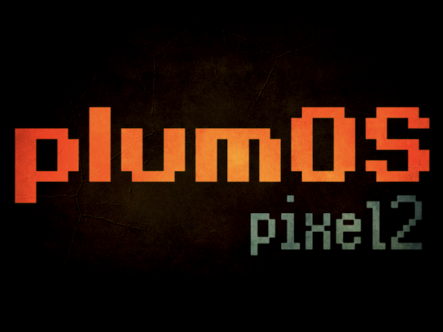
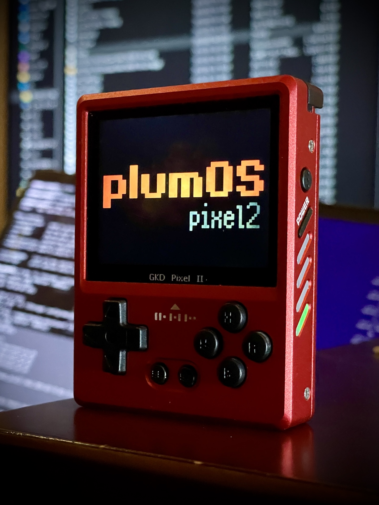
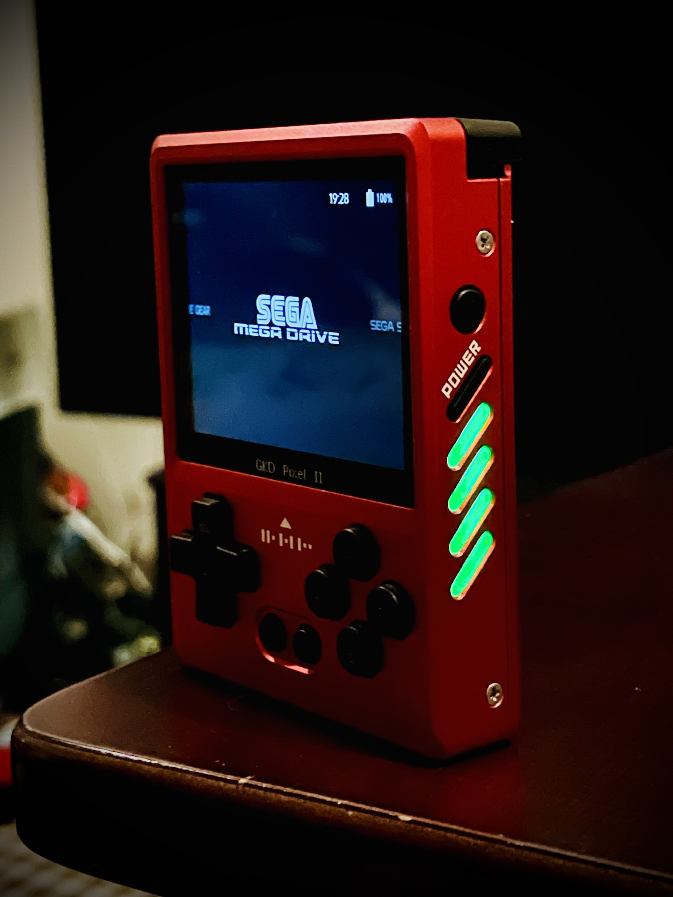

  

   
  

# plumOS-pixel2
GKD-pixel2のStockOSをベースにしたCFWです。


# ダウンロード
ここからSDイメージファイルをダウンロードできます。


# 基本機能
- picoarchが利用可能
- [pyxel](https://github.com/kitao/pyxel) が利用可能(オンラインアプデも可能)
- pixel2用にチューニングされた音質を改善するイコライザーを搭載
- 各アプリのデフォルト言語を英語に変更(一部アプリは中国語のまま)
- Emulationstationのデフォ設定をカスタム(オーバレイ、シェーダーなどを強制しないなど)
- retroarchのカスタム設定(入力遅延軽減など)
- rootパスワード変更に対応(sshでログイン可能)


# OSのホットキー
| Button Combo | Action | 
|:-----------|------------:|
| SELECT + DPAD UP,DOWN | 音量の調整 |
| SELECT + DPAD LEFT,RIGHT | 画面輝度の調整 |


# picoarchについて
- picoarchの利用方法
  - Emulationstation
    - ROM選択画面でセレクトボタンを押して`ADVANCED SYSTEM OPTIONS`からエミュレータの選択をしてください  

| 対応しているlibretroコア |
|:-------:|
|quicknes|
|fceumm|
|snes9x2010|
|picodrive|
|beetle-pce-fast|
|gambatte||
|gpsp|
|pokemini|


- picoarchのホットキー
  - ファストフォーワードは利用できないコアがあります

| Button Combo | Action | 
|:-----------|------------:|
| SELECT + START | メニュー表示 |
| SELECT + R | ステートセーブ |
| SELECT + L | ステートロード |


- picoarchの解像度

| 名前 | 解像度 | 
|:-----------|------------:|
| picoarch_LD |  320x240 |
| picoarch_HD |  640x480 |


# retroarchについて
- セーブファイルおよびステートセーブはromファイルと同じフォルダに作成されます(変更可能)
- ステートセーブファイルはromファイルと同じフォルダに作成されます(変更可能)
- RetroArchのホットキー
  - ※Hotkeyの設定は自由に変更可能です  

| Button Combo | Action | 
|:-----------|------------:|
| Functionボタン     |      Retroarchメニュー表示 |
| SELECT + R       |        ステートセーブ |
| SELECT + L     |      ステートロード |
| SELECT + R2     |      ファストフォワード(早送りx2倍) |
| SELECT + L2     |      スローモーション(x1.5倍) |
| SELECT + X     |      スナップショット(roms/screenshots) |
| SELECT + Y     |      FPS表示 |
|SELECT + START x 2|retroarchの終了


# 各エミュレータのデータ保存場所
セーブデータのバックアップなどをする際に参考にしてください
| Emulator | DIR | 
|:-----------|------------:|
|BIOS|/storage/roms/bios|
| drastic       |        /storage/.config/drastic |
| ppsspp       |         /storage/.config/ppsspp |
| retroarch    |       各romディレクトリ内 |
| picoarch | /storage/.config/.picoarch/data |
| その他のEmu      |       /storage/roms/savestates |


# イコライザー機能について
- イコライザー機能を一時的に無効化したい場合は、Emulationstationの`tools`セクションにある`Equalizer`を実行してください
- イコライザーのチューニングをしたい場合は`/storage/.config/pipewire/pipewire.conf.d/sink-eq6.conf`ファイルを編集します
  - [詳しくはこちらの解説リンクを参考にしてください](https://github.com/game-de-it/plumOS-pixel2/blob/main/EQ.md)


# pyxelについて
- オンラインアップデートを利用する場合
  1. USB Wifiドングルを利用してインターネットに接続できるようします
  2. Emulationstationの`Tools`セクションにある`pyxel_update`を実行します
- pythonモジュールを追加したい場合
  - 下記のシェルスクリプトの例を`roms/ports`ディレクトリに配置して、Emulationstationの`ports`セクションからこのスクリプトを実行します(全てのモジュールがインストールできるとは限りません)
    ```
    #!/bin/sh
    /storage/pyxel_Python/bin/python3 -m pip install pygame
    ```

# SSH接続について
- USB Wifiドングルを利用してください(動作確認済みチップはr8188eu)
- ユーザ名は`root`でパスワードは`plumos`に設定されています
  - パスワードを変更する場合はEmulationstationのSYSTEM SETTINGS->ROOT PASSWORDの値を変更してOSを再起動します
  - 公開鍵認証用を利用してアクセスしたい場合、公開鍵ファイルは`roms/wifi/`ディレクトリにあります 
