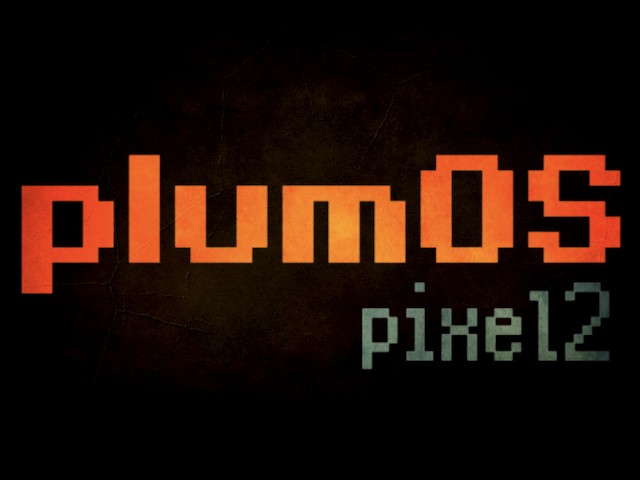
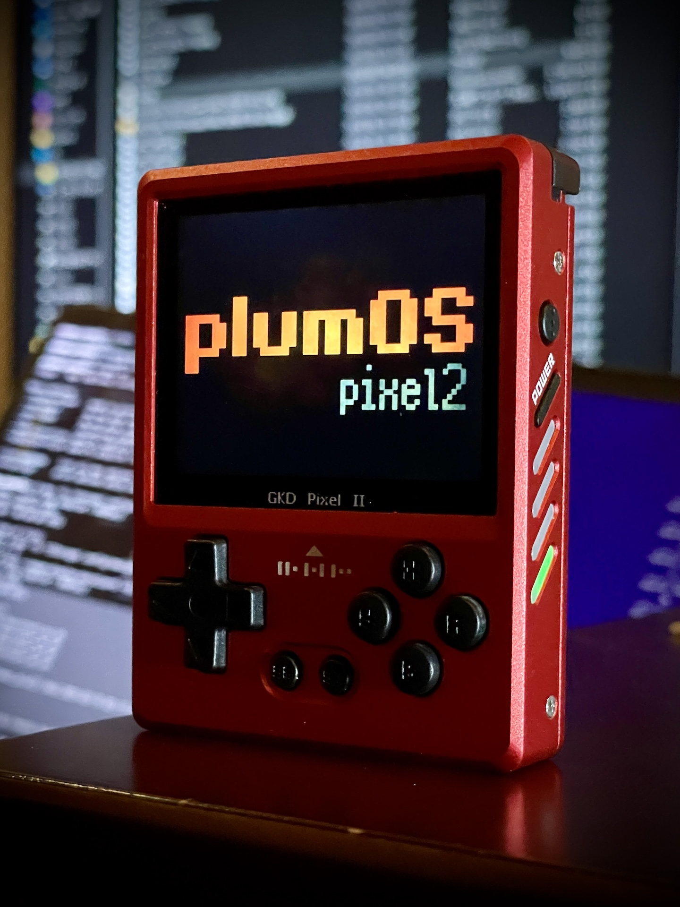
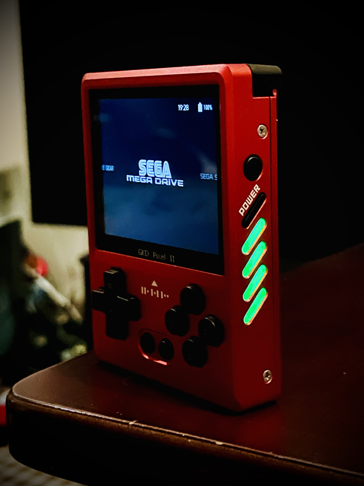

  

   
  

# plumOS-pixel2
A CFW based on the StockOS of GKD-pixel2.


# Download
You can download the SD image file from here.


# Key Features
- picoarch is available
- [pyxel](https://github.com/kitao/pyxel) is available (online updates are also possible)
- Includes an equalizer tuned to improve audio quality for pixel2
- Default language of each app is changed to English (some apps remain in Chinese)
- Custom default settings for EmulationStation (does not enforce overlays, shaders, etc.)
- Custom settings for RetroArch (input lag reduction, etc.)
- Supports changing root password (SSH login enabled)


# OS Hotkeys
| Button Combo | Action | 
|:-----------|------------:|
| SELECT + DPAD UP,DOWN | Adjust volume |
| SELECT + DPAD LEFT,RIGHT | Adjust screen brightness |


# About the USB mass storage function
- If you connect a Windows PC and a pixel2 with a USB cable, you can view the information on the SD card and transfer ROM files.


# About picoarch
- How to use picoarch
  - EmulationStation
    - Press the SELECT button on the ROM selection screen and choose the emulator from `ADVANCED SYSTEM OPTIONS`  

| Supported libretro cores |
|:-------:|
|quicknes|
|fceumm|
|snes9x2010|
|picodrive|
|beetle-pce-fast|
|gambatte|
|gpsp|
|pokemini|


- picoarch Hotkeys
  - Some cores do not support fast forward

| Button Combo | Action | 
|:-----------|------------:|
| SELECT + START | Open menu |
| SELECT + R | Save state |
| SELECT + L | Load state |


- picoarch Resolution

| Name | Resolution | 
|:-----------|------------:|
| picoarch_LD |  320x240 |
| picoarch_HD |  640x480 |


# About RetroArch
- Save files and save states are created in the same folder as the ROM file (configurable)
- Save state files are also created in the same folder as the ROM file (configurable)
- RetroArch Hotkeys
  - *Hotkey settings can be freely customized*  

| Button Combo | Action | 
|:-----------|------------:|
| Function button | Open RetroArch menu |
| SELECT + R | Save state |
| SELECT + L | Load state |
| SELECT + R2 | Fast forward (2x speed) |
| SELECT + L2 | Slow motion (1.5x speed) |
| SELECT + X | Screenshot (saved in roms/screenshots) |
| SELECT + Y | Show FPS |
| SELECT + START x 2 | Exit RetroArch |


# Save Data Locations for Each Emulator
Refer to this when backing up save data.
| Emulator | Directory | 
|:-----------|------------:|
|BIOS|/storage/roms/bios|
| drastic | /storage/.config/drastic |
| ppsspp | /storage/.config/ppsspp |
| retroarch | Inside each ROM directory |
| picoarch | /storage/.config/.picoarch/data |
| Other Emulators | /storage/roms/savestates |


# About the Equalizer Feature
- To temporarily disable the equalizer, run `Equalizer` in the `Tools` section of EmulationStation.
- To adjust the equalizer settings, edit the file `/storage/.config/pipewire/pipewire.conf.d/sink-eq6.conf`.
  - [See this guide for more details](https://github.com/game-de-it/plumOS-pixel2/blob/main/EQ.md)


# About pyxel
- To use online updates:
  1. Connect to the internet using a USB WiFi dongle.
  2. Run `pyxel_update` in the `Tools` section of EmulationStation.
- To install additional Python modules:
  - Place the following shell script example in the `roms/ports` directory and run it from the `ports` section of EmulationStation. (*Not all modules may be installable.*)
    ```
    #!/bin/sh
    /storage/pyxel_Python/bin/python3 -m pip install pygame
    ```

# About SSH Connection
- Use a USB WiFi dongle (Confirmed working chipset: r8188eu)
- Username is `root` and the default password is `plumos`
  - To change the password, go to SYSTEM SETTINGS -> ROOT PASSWORD in EmulationStation and restart the OS.
  - If using public key authentication, the public key file is located in the `roms/wifi/` directory.
